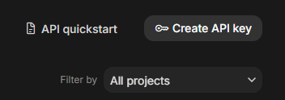

# Gemini API キーの取得方法

このガイドでは、Hana の `/privateai` で使う自分専用の Gemini API キーを作成します。所要時間は約 2～3 分です。

> API キーはパスワードと同じように扱ってください。通常のチャットに投稿したり、他人に渡したり、キー全体が見えるスクリーンショットを公開したりしないでください。漏えいした場合は、そのキーを削除してすぐに新しいキーを作成してください。

## 1. Google AI Studio を開く

[Google AI Studio](https://aistudio.google.com/welcome) を開き、Google アカウントでログインします。

初めて利用する場合は **Get started** を押し、Google の利用条件を確認してから進みます。

## 2. API Keys を開く

AI Studio の Dashboard を開き、左側メニューにある鍵型の **API Keys** アイコンを押します。

## 3. キーを作成する

**Create API Key** を押します。

- 新規ユーザーには、Google が初期プロジェクトとキーを自動作成している場合があります。そのキーを使うことも、別のキーを作ることもできます。
- プロジェクトを求められた場合は、既存のプロジェクトを選ぶか Hana 専用のプロジェクトを作成します。
- 作成後はキーをコピーし、一時的に安全な場所へ保管します。

## 4. Hana にキーを登録する

1. Discord に戻り、`/privateai` を実行します。
2. **2 · Gemini キー追加**、または **Gemini Text & Keys → キー追加** を開きます。
3. `Gemini API key #1` にキーを貼り付け、フォームを送信します。
4. キーの確認と利用可能なテキストモデルの読み込みが終わるまで待ちます。

最初の欄は必須で、残りの欄は空欄でも構いません。Private AI は最大 10 個のキーに対応し、保存前に各キーを暗号化します。

## キーを作成できない場合

- Google の利用規約に同意済みか確認してください。
- 学校・組織アカウントではキー作成権限がない場合があります。個人アカウントを使うか、Google Cloud 管理者へ問い合わせてください。
- 既存のプロジェクトが表示されない場合は、先に AI Studio へ Import する必要があります。
- キーが有効でも、一部のモデルに Free Tier がない場合や、プロジェクトの利用枠に達している場合があります。

Google 公式ドキュメント: [Gemini API を使い始める](https://ai.google.dev/gemini-api/docs/get-started) · [Gemini API キーの管理](https://ai.google.dev/gemini-api/docs/api-key)
