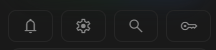

# วิธีรับ Gemini API key

คู่มือนี้ใช้สร้าง Gemini API key ของคุณเองเพื่อนำไปใช้กับ `/privateai` ของ Hana ใช้เวลาประมาณ 2–3 นาที

> API key เปรียบเหมือนรหัสผ่าน ห้ามส่งในห้องแชต ห้ามให้ผู้อื่น และอย่าถ่ายภาพหน้าจอที่เห็นคีย์เต็ม หากเผลอเปิดเผย ให้ลบคีย์นั้นแล้วสร้างใหม่ทันที

## 1. เปิด Google AI Studio

เข้า [Google AI Studio](https://aistudio.google.com/welcome) แล้วเข้าสู่ระบบด้วยบัญชี Google

หากเป็นการเข้าใช้งานครั้งแรก ให้กด **Get started** และอ่านเงื่อนไขของ Google ก่อนดำเนินการต่อ

## 2. เปิดหน้า API Keys

เมื่อเข้าหน้า AI Studio แล้ว ให้เปิด Dashboard และกดไอคอนรูปกุญแจ **API Keys** บริเวณเมนูด้านซ้าย

## 3. สร้างคีย์

กด **Create API Key**

- ผู้ใช้ใหม่อาจมีโปรเจกต์และคีย์เริ่มต้นที่ Google สร้างให้อัตโนมัติอยู่แล้ว สามารถใช้คีย์นั้นหรือสร้างใหม่ก็ได้
- หากระบบถามหาโปรเจกต์ ให้เลือกโปรเจกต์เดิมหรือสร้างโปรเจกต์ใหม่สำหรับ Hana
- เมื่อสร้างเสร็จ ให้กดคัดลอกคีย์และเก็บไว้ชั่วคราวในที่ปลอดภัย

## 4. ใส่คีย์ใน Hana

1. กลับไป Discord แล้วใช้ `/privateai`
2. กด **2 · เพิ่ม Gemini key** หรือเปิด **Gemini Text & Keys → เพิ่มคีย์**
3. วางคีย์ในช่อง `Gemini API key #1` แล้วส่งแบบฟอร์ม
4. รอระบบตรวจคีย์และโหลดรายชื่อโมเดลข้อความ

ช่องแรกจำเป็นต้องใส่ ส่วนช่องอื่นเว้นว่างได้ ระบบรองรับสูงสุด 10 คีย์และเข้ารหัสคีย์ก่อนบันทึก

## หากสร้างคีย์ไม่ได้

- ตรวจว่าได้ยอมรับ Terms of Service ของ Google แล้ว
- บัญชีองค์กรหรือโรงเรียนอาจไม่มีสิทธิ์สร้างคีย์ ให้ใช้บัญชีส่วนตัวหรือติดต่อผู้ดูแล Google Cloud
- หากไม่เห็นโปรเจกต์เดิม อาจต้อง Import โปรเจกต์เข้ามาใน AI Studio ก่อน
- บางโมเดลอาจไม่มี Free Tier หรือติดโควตาของโปรเจกต์ แม้คีย์จะสร้างสำเร็จ

ดูรายละเอียดจาก Google: [การเริ่มต้น Gemini API](https://ai.google.dev/gemini-api/docs/get-started) · [การจัดการ Gemini API key](https://ai.google.dev/gemini-api/docs/api-key)
